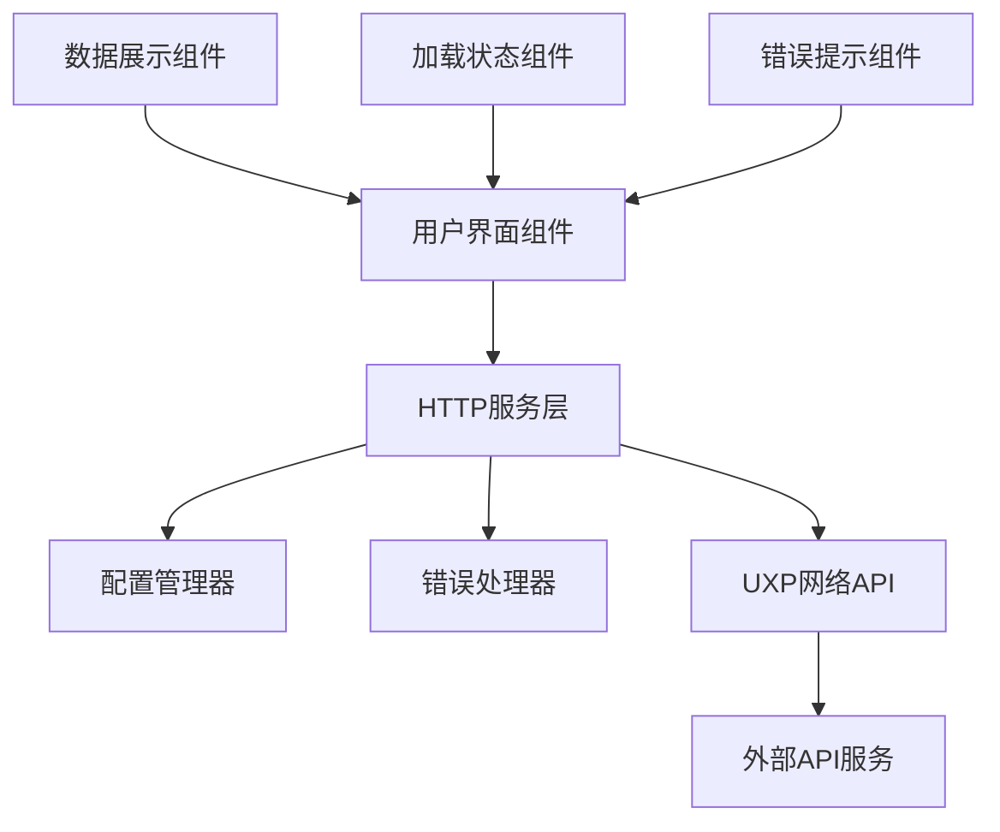

# 设计文档

## 概述

本设计文档描述了在Adobe UXP React插件中实现HTTP API访问功能的技术方案。该功能将使插件能够从外部API获取JSON数据并在用户界面中展示，同时确保在UXP环境中的兼容性和安全性。

## 架构

### 整体架构



### 分层设计

1. **表现层（Presentation Layer）**
   - React组件负责UI渲染
   - 使用Adobe Spectrum Web Components
   - 状态管理使用React Hooks

2. **服务层（Service Layer）**
   - HTTP客户端服务
   - 数据转换和处理
   - 错误处理和重试机制

3. **配置层（Configuration Layer）**
   - API端点配置
   - 请求参数管理
   - 认证信息管理

## 组件和接口

### 核心组件

#### 1. HttpClient 服务类
```javascript
class HttpClient {
  constructor(config) {
    this.baseURL = config.baseURL;
    this.timeout = config.timeout || 10000;
    this.headers = config.headers || {};
    this.tokenManager = new TokenManager();
  }
  
  setToken(token) {
    this.tokenManager.setToken(token);
  }
  
  async get(endpoint, options = {}) {
    const authHeaders = this.tokenManager.getAuthHeaders();
    return this.request('GET', endpoint, null, { ...options, headers: { ...options.headers, ...authHeaders } });
  }
  
  async post(endpoint, data, options = {}) {
    const authHeaders = this.tokenManager.getAuthHeaders();
    return this.request('POST', endpoint, data, { ...options, headers: { ...options.headers, ...authHeaders } });
  }
  
  async request(method, endpoint, data, options = {}) {
    // 统一的请求处理，包含Token鉴权逻辑
  }
}
```

#### 2. ApiDataDisplay 组件
```jsx
const ApiDataDisplay = ({ endpoint, refreshInterval }) => {
  const [data, setData] = useState(null);
  const [loading, setLoading] = useState(false);
  const [error, setError] = useState(null);
  
  // 组件逻辑
};
```

#### 3. ApiConfig 组件
```jsx
const ApiConfig = ({ onConfigChange }) => {
  const [token, setToken] = useState('');
  const [apiUrl, setApiUrl] = useState('');
  
  const handleTokenChange = (value) => {
    setToken(value);
    onConfigChange({ token: value, apiUrl });
  };
  
  const handleUrlChange = (value) => {
    setApiUrl(value);
    onConfigChange({ token, apiUrl: value });
  };
  
  return (
    <div className="api-config">
      <sp-textfield 
        label="API地址" 
        value={apiUrl} 
        onChange={handleUrlChange}
        placeholder="https://api.example.com"
      />
      <sp-textfield 
        label="访问Token" 
        value={token} 
        onChange={handleTokenChange}
        placeholder="输入您的访问Token"
        type="password"
      />
    </div>
  );
};
```

### 接口定义

#### HTTP客户端接口
```typescript
interface HttpClientConfig {
  baseURL: string;
  timeout?: number;
  headers?: Record<string, string>;
  auth?: AuthConfig;
}

interface AuthConfig {
  token?: string;
}

interface ApiResponse<T> {
  data: T;
  status: number;
  statusText: string;
  headers: Record<string, string>;
}

interface ApiError {
  message: string;
  status?: number;
  code?: string;
  authError?: boolean; // 标识是否为鉴权错误
}
```

#### 组件Props接口
```typescript
interface ApiDataDisplayProps {
  endpoint: string;
  refreshInterval?: number;
  onDataReceived?: (data: any) => void;
  onError?: (error: ApiError) => void;
}
```

## 数据模型

### 配置数据模型
```javascript
const defaultConfig = {
  apiEndpoints: {
    primary: {
      url: '',
      headers: {},
      timeout: 10000
    }
  },
  ui: {
    refreshInterval: 30000,
    showLoadingSpinner: true,
    maxRetries: 3
  }
};
```

### 响应数据模型
```javascript
const apiResponseSchema = {
  success: boolean,
  data: any,
  error: {
    code: string,
    message: string
  },
  metadata: {
    timestamp: string,
    requestId: string
  }
};
```

## 错误处理

### 错误类型分类

1. **网络错误**
   - 连接超时
   - 网络不可达
   - DNS解析失败

2. **HTTP错误**
   - 4xx客户端错误
   - 5xx服务器错误
   - 认证失败

3. **数据错误**
   - JSON解析失败
   - 数据格式不匹配
   - 必需字段缺失

### 错误处理策略

```javascript
const errorHandlers = {
  NetworkError: (error) => ({
    message: '网络连接失败，请检查网络设置',
    retry: true,
    delay: 5000
  }),
  
  TimeoutError: (error) => ({
    message: '请求超时，请稍后重试',
    retry: true,
    delay: 3000
  }),
  
  AuthError: (error) => ({
    message: '认证失败，请检查API密钥',
    retry: false
  }),
  
  ParseError: (error) => ({
    message: '数据格式错误，无法解析响应',
    retry: false
  })
};
```

## 测试策略

### 单元测试
- HTTP客户端功能测试
- 错误处理逻辑测试
- 数据转换功能测试
- React组件渲染测试

### 集成测试
- API端点连接测试
- 完整数据流测试
- 错误场景测试

### UXP环境测试
- 插件加载测试
- 网络权限测试
- 性能测试

### 测试工具和框架
- Jest用于单元测试
- React Testing Library用于组件测试
- Mock Service Worker用于API模拟
- UXP Developer Tool用于插件测试

## UXP特定考虑

### 网络权限配置
在manifest.json中需要配置适当的网络权限：

```json
{
  "requiredPermissions": {
    "webview": {
      "allow": "yes",
      "domains": [
        "https://api.example.com",
        "https://*.trusted-domain.com"
      ]
    },
    "launchProcess": {
      "schemes": ["https"]
    }
  }
}
```

### UXP网络API使用
- 使用标准的fetch API
- 遵循UXP的安全限制
- 处理CORS相关问题

### 性能优化
- 实现请求缓存机制
- 使用防抖和节流
- 优化大数据量的渲染

### 鉴权机制

#### Token鉴权方式

**Bearer Token鉴权**
```javascript
const tokenAuth = {
  type: 'bearer',
  token: 'your-access-token'
};
```

#### Token管理器

```javascript
class TokenManager {
  constructor() {
    this.token = null;
  }
  
  setToken(token) {
    this.token = token;
    // 安全存储token
    SecureStorage.storeCredentials('bearer_token', { token });
  }
  
  async getToken() {
    if (!this.token) {
      const stored = await SecureStorage.getCredentials('bearer_token');
      this.token = stored?.token;
    }
    return this.token;
  }
  
  getAuthHeaders() {
    if (!this.token) {
      return {};
    }
    
    return {
      'Authorization': `Bearer ${this.token}`
    };
  }
  
  clearToken() {
    this.token = null;
    localStorage.removeItem('auth_bearer_token');
  }
}
```

#### 安全存储

```javascript
class SecureStorage {
  // 使用UXP的安全存储API
  static async storeCredentials(key, credentials) {
    // 加密存储敏感信息
    const encrypted = await this.encrypt(JSON.stringify(credentials));
    localStorage.setItem(`auth_${key}`, encrypted);
  }
  
  static async getCredentials(key) {
    const encrypted = localStorage.getItem(`auth_${key}`);
    if (!encrypted) return null;
    
    const decrypted = await this.decrypt(encrypted);
    return JSON.parse(decrypted);
  }
  
  static async encrypt(data) {
    // 实现加密逻辑
  }
  
  static async decrypt(encryptedData) {
    // 实现解密逻辑
  }
}
```

### 安全考虑
- **Token的安全存储** - 使用加密存储，避免明文保存Token
- **输入数据验证** - 防止注入攻击
- **XSS防护** - 对API返回数据进行清理
- **敏感数据处理** - 避免在日志中记录Token信息
- **HTTPS强制** - 仅允许HTTPS连接
- **Token过期处理** - 检测401错误并提示用户更新Token

## 技术实现细节

### 网络请求实现
使用现代的fetch API，结合UXP环境的特性：

```javascript
const makeRequest = async (url, options = {}) => {
  const controller = new AbortController();
  const timeoutId = setTimeout(() => controller.abort(), options.timeout || 10000);
  
  try {
    const response = await fetch(url, {
      ...options,
      signal: controller.signal,
      headers: {
        'Content-Type': 'application/json',
        ...options.headers
      }
    });
    
    clearTimeout(timeoutId);
    
    if (!response.ok) {
      throw new Error(`HTTP ${response.status}: ${response.statusText}`);
    }
    
    return await response.json();
  } catch (error) {
    clearTimeout(timeoutId);
    throw error;
  }
};
```

### 状态管理
使用React Hooks进行状态管理：

```javascript
const useApiData = (endpoint, options = {}) => {
  const [state, setState] = useState({
    data: null,
    loading: false,
    error: null
  });
  
  const fetchData = useCallback(async () => {
    setState(prev => ({ ...prev, loading: true, error: null }));
    
    try {
      const data = await httpClient.get(endpoint, options);
      setState({ data, loading: false, error: null });
    } catch (error) {
      setState({ data: null, loading: false, error });
    }
  }, [endpoint, options]);
  
  useEffect(() => {
    fetchData();
  }, [fetchData]);
  
  return { ...state, refetch: fetchData };
};
```

### 组件集成
将HTTP功能集成到现有的组件架构中：

```javascript
// 在现有的面板中添加API数据展示
const EnhancedDemos = () => {
  return (
    <div>
      {/* 现有组件 */}
      <Hello message="React" />
      <ColorPicker />
      
      {/* 新增的API数据组件 */}
      <ApiDataDisplay endpoint="/api/data" />
    </div>
  );
};
```