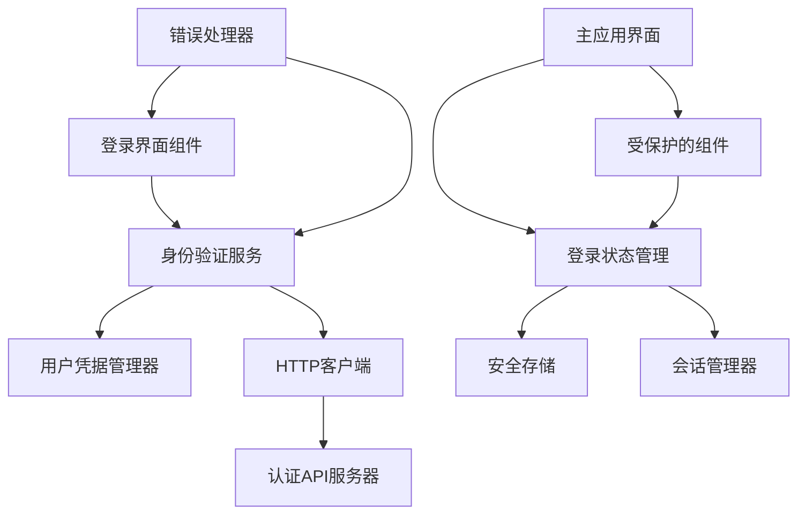

# 设计文档

## 概述

本设计文档描述了在Adobe UXP React插件中实现用户身份验证功能的技术方案。该功能将为插件提供安全的用户登录机制，允许用户通过用户名和密码进行身份验证，并与现有的HTTP API访问功能无缝集成。

## 架构

### 整体架构



### 分层设计

1. **表现层（Presentation Layer）**
   - 登录表单组件
   - 登录状态指示器
   - 错误提示组件
   - 使用Adobe Spectrum Web Components

2. **服务层（Service Layer）**
   - 身份验证服务
   - 用户凭据管理
   - 会话状态管理
   - 与现有HTTP客户端集成

3. **存储层（Storage Layer）**
   - 安全的凭据存储
   - 会话信息持久化
   - 登录状态缓存

## 组件和接口

### 核心组件

#### 1. UserLogin 组件
```jsx
const UserLogin = ({ 
  onLoginSuccess, 
  onLoginError, 
  isLoading = false,
  initialCredentials = {} 
}) => {
  const [username, setUsername] = useState(initialCredentials.username || '');
  const [password, setPassword] = useState('');
  const [rememberMe, setRememberMe] = useState(false);
  const [errors, setErrors] = useState({});
  
  const handleLogin = async (event) => {
    event.preventDefault();
    
    // 验证输入
    const validationErrors = validateCredentials(username, password);
    if (Object.keys(validationErrors).length > 0) {
      setErrors(validationErrors);
      return;
    }
    
    try {
      const result = await authService.login(username, password, rememberMe);
      onLoginSuccess(result);
    } catch (error) {
      setErrors({ general: error.message });
      onLoginError(error);
    }
  };
  
  return (
    <form className="user-login" onSubmit={handleLogin}>
      <div className="login-header">
        <h2>用户登录</h2>
        <p>请输入您的用户名和密码</p>
      </div>
      
      <div className="form-field">
        <sp-textfield
          label="用户名"
          placeholder="请输入用户名"
          value={username}
          onInput={(e) => setUsername(e.target.value)}
          invalid={!!errors.username}
          required
        />
        {errors.username && (
          <div className="field-error">
            <sp-icon name="ui:AlertSmall" size="s"></sp-icon>
            <span>{errors.username}</span>
          </div>
        )}
      </div>
      
      <div className="form-field">
        <sp-textfield
          label="密码"
          placeholder="请输入密码"
          type="password"
          value={password}
          onInput={(e) => setPassword(e.target.value)}
          invalid={!!errors.password}
          required
        />
        {errors.password && (
          <div className="field-error">
            <sp-icon name="ui:AlertSmall" size="s"></sp-icon>
            <span>{errors.password}</span>
          </div>
        )}
      </div>
      
      <div className="form-field">
        <sp-checkbox
          checked={rememberMe}
          onChange={(e) => setRememberMe(e.target.checked)}
        >
          记住登录状态
        </sp-checkbox>
      </div>
      
      {errors.general && (
        <div className="login-error">
          <sp-icon name="ui:AlertSmall" size="s"></sp-icon>
          <span>{errors.general}</span>
        </div>
      )}
      
      <div className="form-actions">
        <sp-button
          type="submit"
          variant="primary"
          disabled={isLoading || !username.trim() || !password.trim()}
        >
          {isLoading ? (
            <>
              <sp-icon name="ui:Refresh" size="s"></sp-icon>
              登录中...
            </>
          ) : (
            <>
              <sp-icon name="ui:CheckmarkSmall" size="s"></sp-icon>
              登录
            </>
          )}
        </sp-button>
      </div>
    </form>
  );
};
```

#### 2. AuthService 服务类
```javascript
class AuthService {
  constructor(httpClient, credentialsManager) {
    this.httpClient = httpClient;
    this.credentialsManager = credentialsManager;
    this.sessionManager = new SessionManager();
    this.loginEndpoint = '/auth/login';
    this.logoutEndpoint = '/auth/logout';
    this.verifyEndpoint = '/auth/verify';
  }
  
  async login(username, password, rememberMe = false) {
    try {
      // 发送登录请求
      const response = await this.httpClient.post(this.loginEndpoint, {
        username: username.trim(),
        password: password,
        rememberMe
      });
      
      const { accessToken, refreshToken, user, expiresIn } = response.data;
      
      // 存储认证信息
      await this.credentialsManager.storeCredentials({
        username,
        accessToken,
        refreshToken,
        user,
        expiresIn,
        rememberMe,
        loginTime: Date.now()
      });
      
      // 设置HTTP客户端的Token
      await this.httpClient.setToken(accessToken);
      
      // 初始化会话
      this.sessionManager.startSession(user, expiresIn);
      
      console.log('用户登录成功:', user);
      
      return {
        success: true,
        user,
        accessToken,
        message: '登录成功'
      };
      
    } catch (error) {
      console.error('登录失败:', error);
      
      // 处理不同类型的登录错误
      if (error.status === 401) {
        throw new Error('用户名或密码错误');
      } else if (error.status === 429) {
        throw new Error('登录尝试过于频繁，请稍后重试');
      } else if (error.name === 'NetworkError') {
        throw new Error('网络连接失败，请检查网络设置');
      } else {
        throw new Error('登录失败，请稍后重试');
      }
    }
  }
  
  async logout() {
    try {
      // 尝试向服务器发送登出请求
      try {
        await this.httpClient.post(this.logoutEndpoint);
      } catch (error) {
        console.warn('服务器登出请求失败，继续本地清理:', error);
      }
      
      // 清除本地存储的认证信息
      await this.credentialsManager.clearCredentials();
      
      // 清除HTTP客户端的Token
      await this.httpClient.clearToken();
      
      // 结束会话
      this.sessionManager.endSession();
      
      console.log('用户已成功登出');
      
      return { success: true, message: '已成功登出' };
      
    } catch (error) {
      console.error('登出过程中发生错误:', error);
      throw new Error('登出失败，请稍后重试');
    }
  }
  
  async verifyToken() {
    try {
      const credentials = await this.credentialsManager.getCredentials();
      if (!credentials || !credentials.accessToken) {
        return { valid: false, reason: 'no_token' };
      }
      
      // 检查Token是否过期
      if (this.isTokenExpired(credentials)) {
        return { valid: false, reason: 'expired' };
      }
      
      // 向服务器验证Token
      const response = await this.httpClient.get(this.verifyEndpoint);
      
      return {
        valid: true,
        user: response.data.user,
        expiresIn: response.data.expiresIn
      };
      
    } catch (error) {
      if (error.status === 401) {
        return { valid: false, reason: 'invalid_token' };
      }
      
      console.error('Token验证失败:', error);
      return { valid: false, reason: 'verification_error' };
    }
  }
  
  async restoreSession() {
    try {
      const credentials = await this.credentialsManager.getCredentials();
      if (!credentials) {
        return { restored: false, reason: 'no_credentials' };
      }
      
      // 验证存储的Token
      const verification = await this.verifyToken();
      if (!verification.valid) {
        // Token无效，清除存储的凭据
        await this.credentialsManager.clearCredentials();
        return { restored: false, reason: verification.reason };
      }
      
      // 恢复HTTP客户端的Token
      await this.httpClient.setToken(credentials.accessToken);
      
      // 恢复会话
      this.sessionManager.restoreSession(verification.user, verification.expiresIn);
      
      console.log('会话已成功恢复:', verification.user);
      
      return {
        restored: true,
        user: verification.user,
        credentials
      };
      
    } catch (error) {
      console.error('会话恢复失败:', error);
      return { restored: false, reason: 'restore_error' };
    }
  }
  
  isTokenExpired(credentials) {
    if (!credentials.expiresIn || !credentials.loginTime) {
      return false; // 无法确定过期时间，假设未过期
    }
    
    const expirationTime = credentials.loginTime + (credentials.expiresIn * 1000);
    return Date.now() >= expirationTime;
  }
  
  getCurrentUser() {
    return this.sessionManager.getCurrentUser();
  }
  
  isLoggedIn() {
    return this.sessionManager.isActive();
  }
}
```

#### 3. UserCredentialsManager 类
```javascript
class UserCredentialsManager {
  constructor(secureStorage) {
    this.secureStorage = secureStorage;
    this.storageKey = 'user_credentials';
  }
  
  async storeCredentials(credentials) {
    try {
      const credentialsToStore = {
        username: credentials.username,
        accessToken: credentials.accessToken,
        refreshToken: credentials.refreshToken,
        user: credentials.user,
        expiresIn: credentials.expiresIn,
        rememberMe: credentials.rememberMe,
        loginTime: credentials.loginTime || Date.now()
      };
      
      const success = await this.secureStorage.storeCredentials(
        this.storageKey, 
        credentialsToStore
      );
      
      if (success) {
        console.log('用户凭据已安全存储');
        return true;
      } else {
        throw new Error('凭据存储失败');
      }
    } catch (error) {
      console.error('存储用户凭据失败:', error);
      return false;
    }
  }
  
  async getCredentials() {
    try {
      const credentials = await this.secureStorage.getCredentials(this.storageKey);
      if (credentials) {
        console.log('用户凭据已成功获取');
      }
      return credentials;
    } catch (error) {
      console.error('获取用户凭据失败:', error);
      return null;
    }
  }
  
  async clearCredentials() {
    try {
      const success = await this.secureStorage.removeCredentials(this.storageKey);
      if (success) {
        console.log('用户凭据已清除');
        return true;
      } else {
        throw new Error('凭据清除失败');
      }
    } catch (error) {
      console.error('清除用户凭据失败:', error);
      return false;
    }
  }
  
  async hasCredentials() {
    return this.secureStorage.hasCredentials(this.storageKey);
  }
  
  async getStoredUsername() {
    try {
      const credentials = await this.getCredentials();
      return credentials?.username || null;
    } catch (error) {
      console.error('获取存储的用户名失败:', error);
      return null;
    }
  }
}
```

#### 4. SessionManager 类
```javascript
class SessionManager {
  constructor() {
    this.currentUser = null;
    this.sessionStartTime = null;
    this.sessionExpiresAt = null;
    this.isSessionActive = false;
    this.sessionListeners = [];
  }
  
  startSession(user, expiresIn) {
    this.currentUser = user;
    this.sessionStartTime = Date.now();
    this.sessionExpiresAt = expiresIn ? Date.now() + (expiresIn * 1000) : null;
    this.isSessionActive = true;
    
    console.log('会话已启动:', user);
    this.notifySessionChange('started', user);
  }
  
  restoreSession(user, expiresIn) {
    this.currentUser = user;
    this.sessionStartTime = Date.now(); // 重置会话开始时间
    this.sessionExpiresAt = expiresIn ? Date.now() + (expiresIn * 1000) : null;
    this.isSessionActive = true;
    
    console.log('会话已恢复:', user);
    this.notifySessionChange('restored', user);
  }
  
  endSession() {
    const previousUser = this.currentUser;
    
    this.currentUser = null;
    this.sessionStartTime = null;
    this.sessionExpiresAt = null;
    this.isSessionActive = false;
    
    console.log('会话已结束');
    this.notifySessionChange('ended', previousUser);
  }
  
  getCurrentUser() {
    return this.currentUser;
  }
  
  isActive() {
    if (!this.isSessionActive) {
      return false;
    }
    
    // 检查会话是否过期
    if (this.sessionExpiresAt && Date.now() >= this.sessionExpiresAt) {
      this.endSession();
      return false;
    }
    
    return true;
  }
  
  getSessionInfo() {
    return {
      user: this.currentUser,
      startTime: this.sessionStartTime,
      expiresAt: this.sessionExpiresAt,
      isActive: this.isActive(),
      duration: this.sessionStartTime ? Date.now() - this.sessionStartTime : 0
    };
  }
  
  addSessionListener(listener) {
    this.sessionListeners.push(listener);
  }
  
  removeSessionListener(listener) {
    const index = this.sessionListeners.indexOf(listener);
    if (index > -1) {
      this.sessionListeners.splice(index, 1);
    }
  }
  
  notifySessionChange(event, user) {
    this.sessionListeners.forEach(listener => {
      try {
        listener(event, user);
      } catch (error) {
        console.error('会话监听器执行失败:', error);
      }
    });
  }
}
```

#### 5. AuthGuard 组件
```jsx
const AuthGuard = ({ 
  children, 
  fallback = null, 
  requireAuth = true,
  onAuthRequired 
}) => {
  const { isLoggedIn, user, isLoading } = useAuth();
  
  if (isLoading) {
    return (
      <div className="auth-loading">
        <sp-icon name="ui:Refresh" size="m"></sp-icon>
        <span>验证登录状态...</span>
      </div>
    );
  }
  
  if (requireAuth && !isLoggedIn) {
    if (onAuthRequired) {
      onAuthRequired();
    }
    
    return fallback || (
      <div className="auth-required">
        <sp-icon name="ui:LockSmall" size="m"></sp-icon>
        <p>此功能需要登录后使用</p>
      </div>
    );
  }
  
  return children;
};
```

### 接口定义

#### 身份验证接口
```typescript
interface LoginCredentials {
  username: string;
  password: string;
  rememberMe?: boolean;
}

interface LoginResponse {
  success: boolean;
  user: User;
  accessToken: string;
  refreshToken?: string;
  expiresIn?: number;
  message: string;
}

interface User {
  id: string;
  username: string;
  email?: string;
  displayName?: string;
  roles?: string[];
  permissions?: string[];
}

interface AuthError {
  message: string;
  code?: string;
  status?: number;
  field?: string; // 用于表单字段错误
}

interface SessionInfo {
  user: User | null;
  startTime: number | null;
  expiresAt: number | null;
  isActive: boolean;
  duration: number;
}
```

#### 组件Props接口
```typescript
interface UserLoginProps {
  onLoginSuccess: (result: LoginResponse) => void;
  onLoginError: (error: AuthError) => void;
  isLoading?: boolean;
  initialCredentials?: Partial<LoginCredentials>;
  showRememberMe?: boolean;
  autoFocus?: boolean;
}

interface AuthGuardProps {
  children: React.ReactNode;
  fallback?: React.ReactNode;
  requireAuth?: boolean;
  onAuthRequired?: () => void;
}
```

## 数据模型

### 用户凭据数据模型
```javascript
const userCredentialsSchema = {
  username: String,
  accessToken: String,
  refreshToken: String,
  user: {
    id: String,
    username: String,
    email: String,
    displayName: String,
    roles: [String],
    permissions: [String]
  },
  expiresIn: Number, // 秒
  rememberMe: Boolean,
  loginTime: Number // 时间戳
};
```

### 会话数据模型
```javascript
const sessionSchema = {
  user: Object, // User对象
  startTime: Number, // 时间戳
  expiresAt: Number, // 时间戳
  isActive: Boolean,
  lastActivity: Number // 时间戳
};
```

## 错误处理

### 错误类型分类

1. **验证错误**
   - 用户名为空
   - 密码为空
   - 用户名格式无效

2. **认证错误**
   - 用户名或密码错误
   - 账户被锁定
   - 登录尝试过于频繁

3. **网络错误**
   - 连接超时
   - 网络不可达
   - 服务器错误

4. **会话错误**
   - Token过期
   - 会话无效
   - 权限不足

### 错误处理策略

```javascript
const authErrorHandlers = {
  ValidationError: (error) => ({
    message: error.message,
    field: error.field,
    showInForm: true,
    retry: false
  }),
  
  AuthenticationError: (error) => ({
    message: '用户名或密码错误，请重新输入',
    showInForm: true,
    retry: true,
    clearPassword: true
  }),
  
  NetworkError: (error) => ({
    message: '网络连接失败，请检查网络设置后重试',
    showInForm: true,
    retry: true,
    delay: 3000
  }),
  
  SessionExpiredError: (error) => ({
    message: '登录已过期，请重新登录',
    requireReauth: true,
    clearSession: true
  }),
  
  RateLimitError: (error) => ({
    message: '登录尝试过于频繁，请稍后重试',
    showInForm: true,
    retry: false,
    delay: error.retryAfter || 60000
  })
};
```

## 测试策略

### 单元测试
- AuthService 登录/登出功能测试
- UserCredentialsManager 凭据管理测试
- SessionManager 会话管理测试
- UserLogin 组件渲染和交互测试
- 错误处理逻辑测试

### 集成测试
- 完整登录流程测试
- 会话恢复测试
- 与HTTP客户端集成测试
- 错误场景端到端测试

### 安全测试
- 凭据存储安全性测试
- Token传输安全性测试
- 会话管理安全性测试

## 安全考虑

### 凭据安全
- **密码处理** - 密码不在客户端存储，仅在传输时使用
- **Token存储** - 使用加密存储保护访问令牌
- **会话管理** - 实现自动过期和清理机制
- **传输安全** - 强制使用HTTPS进行所有认证请求

### 输入验证
- **用户名验证** - 检查格式和长度限制
- **密码强度** - 可选的密码复杂度验证
- **防注入** - 对所有输入进行清理和验证

### 会话安全
- **自动过期** - 基于服务器返回的过期时间
- **活动检测** - 检测用户活动并延长会话
- **安全登出** - 确保完全清理本地状态

## 与现有系统集成

### HTTP客户端集成
```javascript
// 在现有的HttpClient中添加认证支持
class EnhancedHttpClient extends HttpClient {
  constructor(config) {
    super(config);
    this.authService = null;
  }
  
  setAuthService(authService) {
    this.authService = authService;
  }
  
  async request(method, endpoint, data, options) {
    try {
      return await super.request(method, endpoint, data, options);
    } catch (error) {
      // 处理401认证错误
      if (error.status === 401 && this.authService) {
        console.log('检测到认证失败，尝试重新认证');
        
        // 触发重新登录流程
        this.authService.handleAuthenticationRequired();
        
        // 标记错误需要重新认证
        error.requiresReauth = true;
      }
      
      throw error;
    }
  }
}
```

### 现有组件集成
```jsx
// 在Demos面板中集成登录功能
const EnhancedDemos = () => {
  const { isLoggedIn, user, login, logout } = useAuth();
  
  return (
    <div style={{ padding: '16px' }}>
      {/* 登录状态显示 */}
      <div className="auth-status">
        {isLoggedIn ? (
          <div className="logged-in">
            <sp-icon name="ui:UserSmall" size="s"></sp-icon>
            <span>欢迎，{user?.displayName || user?.username}</span>
            <sp-button size="s" variant="secondary" onClick={logout}>
              登出
            </sp-button>
          </div>
        ) : (
          <div className="logged-out">
            <sp-icon name="ui:LockSmall" size="s"></sp-icon>
            <span>未登录</span>
          </div>
        )}
      </div>
      
      {/* 现有功能 */}
      <Hello message="React UXP Plugin" />
      <ColorPicker />
      
      {/* 需要认证的功能 */}
      <AuthGuard
        fallback={<UserLogin onLoginSuccess={login} />}
      >
        <ApiConfig />
        <ApiDataDisplay />
      </AuthGuard>
    </div>
  );
};
```

### 状态管理集成
```javascript
// 创建认证Hook
const useAuth = () => {
  const [authState, setAuthState] = useState({
    isLoggedIn: false,
    user: null,
    isLoading: true,
    error: null
  });
  
  const authService = useMemo(() => 
    new AuthService(httpClient, new UserCredentialsManager(secureStorage)), 
    []
  );
  
  useEffect(() => {
    // 应用启动时尝试恢复会话
    const restoreSession = async () => {
      try {
        const result = await authService.restoreSession();
        if (result.restored) {
          setAuthState({
            isLoggedIn: true,
            user: result.user,
            isLoading: false,
            error: null
          });
        } else {
          setAuthState({
            isLoggedIn: false,
            user: null,
            isLoading: false,
            error: null
          });
        }
      } catch (error) {
        setAuthState({
          isLoggedIn: false,
          user: null,
          isLoading: false,
          error: error.message
        });
      }
    };
    
    restoreSession();
  }, [authService]);
  
  const login = async (username, password, rememberMe) => {
    setAuthState(prev => ({ ...prev, isLoading: true, error: null }));
    
    try {
      const result = await authService.login(username, password, rememberMe);
      setAuthState({
        isLoggedIn: true,
        user: result.user,
        isLoading: false,
        error: null
      });
      return result;
    } catch (error) {
      setAuthState(prev => ({
        ...prev,
        isLoading: false,
        error: error.message
      }));
      throw error;
    }
  };
  
  const logout = async () => {
    try {
      await authService.logout();
      setAuthState({
        isLoggedIn: false,
        user: null,
        isLoading: false,
        error: null
      });
    } catch (error) {
      console.error('登出失败:', error);
    }
  };
  
  return {
    ...authState,
    login,
    logout,
    authService
  };
};
```

## 性能优化

### 组件优化
- 使用React.memo优化登录组件渲染
- 实现输入防抖减少验证频率
- 懒加载认证相关组件

### 网络优化
- 实现请求缓存避免重复验证
- 使用请求去重避免并发登录
- 优化Token刷新机制

### 存储优化
- 最小化存储的数据量
- 实现存储清理机制
- 优化加密/解密性能

## UXP特定考虑

### 权限配置
在manifest.json中需要配置网络权限：

```json
{
  "requiredPermissions": {
    "webview": {
      "allow": "yes",
      "domains": [
        "https://your-auth-server.com",
        "https://api.your-domain.com"
      ]
    },
    "launchProcess": {
      "schemes": ["https"]
    }
  }
}
```

### 存储限制
- 使用localStorage进行本地存储
- 实现存储配额管理
- 处理存储失败的情况

### 网络限制
- 遵循UXP的网络安全策略
- 处理CORS相关问题
- 实现网络状态检测